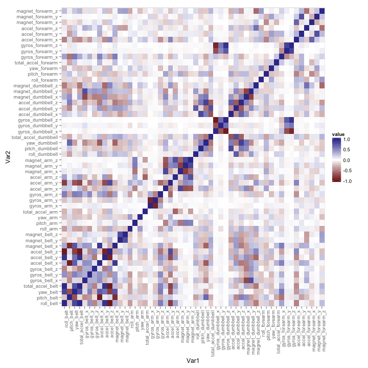
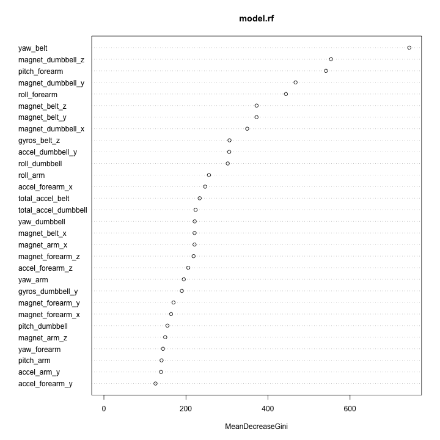

# Executive Summary

Using devices such as [*Jawbone Up*](https://jawbone.com/up), [*Nike FuelBand*](http://www.nike.com/us/en_us/c/nikeplus-fuelband) or [*Fitbit*](http://www.fitbit.com/) it is now possible to collect a large amount of data about personal activity relatively inexpensively. These type of devices are part of the quantified self movement – a group of enthusiasts who take measurements about themselves regularly to improve their health, to find patterns in their behavior, or because they are tech geeks. One thing that people regularly do is quantify how much of a particular activity they do, but they rarely quantify how well they do it. 

The goal of this project is to use data from accelerometers on the belt, forearm, arm, and dumbell of 6 participants where they were asked to perform barbell lifts correctly and incorrectly in 5 different ways; and build a model to predict the manner in which they did the exercise. 

# Dataset 

The dataset for this project is the [*Weight Lifting Exercises Dataset*](http://groupware.les.inf.puc-rio.br/har). 

Human activity recognition research has traditionally focused on discriminating between different activities, i.e. to predict "which" activity was performed at a specific point in time. The approach proposed for the Weight Lifting Exercises dataset is to investigate "how (well)" an activity was performed. 

Six young health participants were asked to perform one set of 10 repetitions of the Unilateral Dumbbell Biceps Curl in five different fashions: exactly according to the specification (Class A), throwing the elbows to the front (Class B), lifting the dumbbell only halfway (Class C), lowering the dumbbell only halfway (Class D) and throwing the hips to the front (Class E). Class A corresponds to the specified execution of the exercise, while the other 4 classes correspond to common mistakes. 

For more information please visit http://groupware.les.inf.puc-rio.br/har.

For this project, we have a training and a testing dataset and both can be downloaded here:

* training dataset: https://d396qusza40orc.cloudfront.net/predmachlearn/pml-training.csv
* testing dataset: https://d396qusza40orc.cloudfront.net/predmachlearn/pml-testing.csv

## Download dataset 


```r
# dataset folder to store the training and testing dataset
data.folder <- "./Datasets/"
# current date in format YYYYMMDD
date <- gsub(pattern="-", replacement = "", Sys.Date()) 
# download training dataset  
training.url <- "https://d396qusza40orc.cloudfront.net/predmachlearn/pml-training.csv"
training.file.name <- paste(data.folder,"training_",date,".csv", sep="")
download.file(training.url, training.file.name , method = "curl")
# download testing dataset  
testing.url <- "https://d396qusza40orc.cloudfront.net/predmachlearn/pml-testing.csv"
testing.file.name <- paste(data.folder,"testing_",date,".csv", sep="")
download.file(testing.url, testing.file.name , method = "curl")
```

## Read dataset


```r
# read training and testing datasets
training <- read.csv(training.file.name, header = TRUE, stringsAsFactors = FALSE)
testing <- read.csv(testing.file.name, header = TRUE, stringsAsFactors = FALSE)
# display structure of training and testing datasets
str(training) # 160 variables, 19622 observations
```

```
## 'data.frame':	19622 obs. of  160 variables:
##  $ X                       : int  1 2 3 4 5 6 7 8 9 10 ...
##  $ user_name               : chr  "carlitos" "carlitos" "carlitos" "carlitos" ...
##  $ raw_timestamp_part_1    : int  1323084231 1323084231 1323084231 1323084232 1323084232 1323084232 1323084232 1323084232 1323084232 1323084232 ...
##  $ raw_timestamp_part_2    : int  788290 808298 820366 120339 196328 304277 368296 440390 484323 484434 ...
##  $ cvtd_timestamp          : chr  "05/12/2011 11:23" "05/12/2011 11:23" "05/12/2011 11:23" "05/12/2011 11:23" ...
##  $ new_window              : chr  "no" "no" "no" "no" ...
##  $ num_window              : int  11 11 11 12 12 12 12 12 12 12 ...
##  $ roll_belt               : num  1.41 1.41 1.42 1.48 1.48 1.45 1.42 1.42 1.43 1.45 ...
##  $ pitch_belt              : num  8.07 8.07 8.07 8.05 8.07 8.06 8.09 8.13 8.16 8.17 ...
##  $ yaw_belt                : num  -94.4 -94.4 -94.4 -94.4 -94.4 -94.4 -94.4 -94.4 -94.4 -94.4 ...
##  $ total_accel_belt        : int  3 3 3 3 3 3 3 3 3 3 ...
##  $ kurtosis_roll_belt      : chr  "" "" "" "" ...
##  $ kurtosis_picth_belt     : chr  "" "" "" "" ...
##  $ kurtosis_yaw_belt       : chr  "" "" "" "" ...
##  $ skewness_roll_belt      : chr  "" "" "" "" ...
##  $ skewness_roll_belt.1    : chr  "" "" "" "" ...
##  $ skewness_yaw_belt       : chr  "" "" "" "" ...
##  $ max_roll_belt           : num  NA NA NA NA NA NA NA NA NA NA ...
##  $ max_picth_belt          : int  NA NA NA NA NA NA NA NA NA NA ...
##  $ max_yaw_belt            : chr  "" "" "" "" ...
##  $ min_roll_belt           : num  NA NA NA NA NA NA NA NA NA NA ...
##  $ min_pitch_belt          : int  NA NA NA NA NA NA NA NA NA NA ...
##  $ min_yaw_belt            : chr  "" "" "" "" ...
##  $ amplitude_roll_belt     : num  NA NA NA NA NA NA NA NA NA NA ...
##  $ amplitude_pitch_belt    : int  NA NA NA NA NA NA NA NA NA NA ...
##  $ amplitude_yaw_belt      : chr  "" "" "" "" ...
##  $ var_total_accel_belt    : num  NA NA NA NA NA NA NA NA NA NA ...
##  $ avg_roll_belt           : num  NA NA NA NA NA NA NA NA NA NA ...
##  $ stddev_roll_belt        : num  NA NA NA NA NA NA NA NA NA NA ...
##  $ var_roll_belt           : num  NA NA NA NA NA NA NA NA NA NA ...
##  $ avg_pitch_belt          : num  NA NA NA NA NA NA NA NA NA NA ...
##  $ stddev_pitch_belt       : num  NA NA NA NA NA NA NA NA NA NA ...
##  $ var_pitch_belt          : num  NA NA NA NA NA NA NA NA NA NA ...
##  $ avg_yaw_belt            : num  NA NA NA NA NA NA NA NA NA NA ...
##  $ stddev_yaw_belt         : num  NA NA NA NA NA NA NA NA NA NA ...
##  $ var_yaw_belt            : num  NA NA NA NA NA NA NA NA NA NA ...
##  $ gyros_belt_x            : num  0 0.02 0 0.02 0.02 0.02 0.02 0.02 0.02 0.03 ...
##  $ gyros_belt_y            : num  0 0 0 0 0.02 0 0 0 0 0 ...
##  $ gyros_belt_z            : num  -0.02 -0.02 -0.02 -0.03 -0.02 -0.02 -0.02 -0.02 -0.02 0 ...
##  $ accel_belt_x            : int  -21 -22 -20 -22 -21 -21 -22 -22 -20 -21 ...
##  $ accel_belt_y            : int  4 4 5 3 2 4 3 4 2 4 ...
##  $ accel_belt_z            : int  22 22 23 21 24 21 21 21 24 22 ...
##  $ magnet_belt_x           : int  -3 -7 -2 -6 -6 0 -4 -2 1 -3 ...
##  $ magnet_belt_y           : int  599 608 600 604 600 603 599 603 602 609 ...
##  $ magnet_belt_z           : int  -313 -311 -305 -310 -302 -312 -311 -313 -312 -308 ...
##  $ roll_arm                : num  -128 -128 -128 -128 -128 -128 -128 -128 -128 -128 ...
##  $ pitch_arm               : num  22.5 22.5 22.5 22.1 22.1 22 21.9 21.8 21.7 21.6 ...
##  $ yaw_arm                 : num  -161 -161 -161 -161 -161 -161 -161 -161 -161 -161 ...
##  $ total_accel_arm         : int  34 34 34 34 34 34 34 34 34 34 ...
##  $ var_accel_arm           : num  NA NA NA NA NA NA NA NA NA NA ...
##  $ avg_roll_arm            : num  NA NA NA NA NA NA NA NA NA NA ...
##  $ stddev_roll_arm         : num  NA NA NA NA NA NA NA NA NA NA ...
##  $ var_roll_arm            : num  NA NA NA NA NA NA NA NA NA NA ...
##  $ avg_pitch_arm           : num  NA NA NA NA NA NA NA NA NA NA ...
##  $ stddev_pitch_arm        : num  NA NA NA NA NA NA NA NA NA NA ...
##  $ var_pitch_arm           : num  NA NA NA NA NA NA NA NA NA NA ...
##  $ avg_yaw_arm             : num  NA NA NA NA NA NA NA NA NA NA ...
##  $ stddev_yaw_arm          : num  NA NA NA NA NA NA NA NA NA NA ...
##  $ var_yaw_arm             : num  NA NA NA NA NA NA NA NA NA NA ...
##  $ gyros_arm_x             : num  0 0.02 0.02 0.02 0 0.02 0 0.02 0.02 0.02 ...
##  $ gyros_arm_y             : num  0 -0.02 -0.02 -0.03 -0.03 -0.03 -0.03 -0.02 -0.03 -0.03 ...
##  $ gyros_arm_z             : num  -0.02 -0.02 -0.02 0.02 0 0 0 0 -0.02 -0.02 ...
##  $ accel_arm_x             : int  -288 -290 -289 -289 -289 -289 -289 -289 -288 -288 ...
##  $ accel_arm_y             : int  109 110 110 111 111 111 111 111 109 110 ...
##  $ accel_arm_z             : int  -123 -125 -126 -123 -123 -122 -125 -124 -122 -124 ...
##  $ magnet_arm_x            : int  -368 -369 -368 -372 -374 -369 -373 -372 -369 -376 ...
##  $ magnet_arm_y            : int  337 337 344 344 337 342 336 338 341 334 ...
##  $ magnet_arm_z            : int  516 513 513 512 506 513 509 510 518 516 ...
##  $ kurtosis_roll_arm       : chr  "" "" "" "" ...
##  $ kurtosis_picth_arm      : chr  "" "" "" "" ...
##  $ kurtosis_yaw_arm        : chr  "" "" "" "" ...
##  $ skewness_roll_arm       : chr  "" "" "" "" ...
##  $ skewness_pitch_arm      : chr  "" "" "" "" ...
##  $ skewness_yaw_arm        : chr  "" "" "" "" ...
##  $ max_roll_arm            : num  NA NA NA NA NA NA NA NA NA NA ...
##  $ max_picth_arm           : num  NA NA NA NA NA NA NA NA NA NA ...
##  $ max_yaw_arm             : int  NA NA NA NA NA NA NA NA NA NA ...
##  $ min_roll_arm            : num  NA NA NA NA NA NA NA NA NA NA ...
##  $ min_pitch_arm           : num  NA NA NA NA NA NA NA NA NA NA ...
##  $ min_yaw_arm             : int  NA NA NA NA NA NA NA NA NA NA ...
##  $ amplitude_roll_arm      : num  NA NA NA NA NA NA NA NA NA NA ...
##  $ amplitude_pitch_arm     : num  NA NA NA NA NA NA NA NA NA NA ...
##  $ amplitude_yaw_arm       : int  NA NA NA NA NA NA NA NA NA NA ...
##  $ roll_dumbbell           : num  13.1 13.1 12.9 13.4 13.4 ...
##  $ pitch_dumbbell          : num  -70.5 -70.6 -70.3 -70.4 -70.4 ...
##  $ yaw_dumbbell            : num  -84.9 -84.7 -85.1 -84.9 -84.9 ...
##  $ kurtosis_roll_dumbbell  : chr  "" "" "" "" ...
##  $ kurtosis_picth_dumbbell : chr  "" "" "" "" ...
##  $ kurtosis_yaw_dumbbell   : chr  "" "" "" "" ...
##  $ skewness_roll_dumbbell  : chr  "" "" "" "" ...
##  $ skewness_pitch_dumbbell : chr  "" "" "" "" ...
##  $ skewness_yaw_dumbbell   : chr  "" "" "" "" ...
##  $ max_roll_dumbbell       : num  NA NA NA NA NA NA NA NA NA NA ...
##  $ max_picth_dumbbell      : num  NA NA NA NA NA NA NA NA NA NA ...
##  $ max_yaw_dumbbell        : chr  "" "" "" "" ...
##  $ min_roll_dumbbell       : num  NA NA NA NA NA NA NA NA NA NA ...
##  $ min_pitch_dumbbell      : num  NA NA NA NA NA NA NA NA NA NA ...
##  $ min_yaw_dumbbell        : chr  "" "" "" "" ...
##  $ amplitude_roll_dumbbell : num  NA NA NA NA NA NA NA NA NA NA ...
##   [list output truncated]
```

```r
str(testing) # 160 variables, 20 observations
```

```
## 'data.frame':	20 obs. of  160 variables:
##  $ X                       : int  1 2 3 4 5 6 7 8 9 10 ...
##  $ user_name               : chr  "pedro" "jeremy" "jeremy" "adelmo" ...
##  $ raw_timestamp_part_1    : int  1323095002 1322673067 1322673075 1322832789 1322489635 1322673149 1322673128 1322673076 1323084240 1322837822 ...
##  $ raw_timestamp_part_2    : int  868349 778725 342967 560311 814776 510661 766645 54671 916313 384285 ...
##  $ cvtd_timestamp          : chr  "05/12/2011 14:23" "30/11/2011 17:11" "30/11/2011 17:11" "02/12/2011 13:33" ...
##  $ new_window              : chr  "no" "no" "no" "no" ...
##  $ num_window              : int  74 431 439 194 235 504 485 440 323 664 ...
##  $ roll_belt               : num  123 1.02 0.87 125 1.35 -5.92 1.2 0.43 0.93 114 ...
##  $ pitch_belt              : num  27 4.87 1.82 -41.6 3.33 1.59 4.44 4.15 6.72 22.4 ...
##  $ yaw_belt                : num  -4.75 -88.9 -88.5 162 -88.6 -87.7 -87.3 -88.5 -93.7 -13.1 ...
##  $ total_accel_belt        : int  20 4 5 17 3 4 4 4 4 18 ...
##  $ kurtosis_roll_belt      : logi  NA NA NA NA NA NA ...
##  $ kurtosis_picth_belt     : logi  NA NA NA NA NA NA ...
##  $ kurtosis_yaw_belt       : logi  NA NA NA NA NA NA ...
##  $ skewness_roll_belt      : logi  NA NA NA NA NA NA ...
##  $ skewness_roll_belt.1    : logi  NA NA NA NA NA NA ...
##  $ skewness_yaw_belt       : logi  NA NA NA NA NA NA ...
##  $ max_roll_belt           : logi  NA NA NA NA NA NA ...
##  $ max_picth_belt          : logi  NA NA NA NA NA NA ...
##  $ max_yaw_belt            : logi  NA NA NA NA NA NA ...
##  $ min_roll_belt           : logi  NA NA NA NA NA NA ...
##  $ min_pitch_belt          : logi  NA NA NA NA NA NA ...
##  $ min_yaw_belt            : logi  NA NA NA NA NA NA ...
##  $ amplitude_roll_belt     : logi  NA NA NA NA NA NA ...
##  $ amplitude_pitch_belt    : logi  NA NA NA NA NA NA ...
##  $ amplitude_yaw_belt      : logi  NA NA NA NA NA NA ...
##  $ var_total_accel_belt    : logi  NA NA NA NA NA NA ...
##  $ avg_roll_belt           : logi  NA NA NA NA NA NA ...
##  $ stddev_roll_belt        : logi  NA NA NA NA NA NA ...
##  $ var_roll_belt           : logi  NA NA NA NA NA NA ...
##  $ avg_pitch_belt          : logi  NA NA NA NA NA NA ...
##  $ stddev_pitch_belt       : logi  NA NA NA NA NA NA ...
##  $ var_pitch_belt          : logi  NA NA NA NA NA NA ...
##  $ avg_yaw_belt            : logi  NA NA NA NA NA NA ...
##  $ stddev_yaw_belt         : logi  NA NA NA NA NA NA ...
##  $ var_yaw_belt            : logi  NA NA NA NA NA NA ...
##  $ gyros_belt_x            : num  -0.5 -0.06 0.05 0.11 0.03 0.1 -0.06 -0.18 0.1 0.14 ...
##  $ gyros_belt_y            : num  -0.02 -0.02 0.02 0.11 0.02 0.05 0 -0.02 0 0.11 ...
##  $ gyros_belt_z            : num  -0.46 -0.07 0.03 -0.16 0 -0.13 0 -0.03 -0.02 -0.16 ...
##  $ accel_belt_x            : int  -38 -13 1 46 -8 -11 -14 -10 -15 -25 ...
##  $ accel_belt_y            : int  69 11 -1 45 4 -16 2 -2 1 63 ...
##  $ accel_belt_z            : int  -179 39 49 -156 27 38 35 42 32 -158 ...
##  $ magnet_belt_x           : int  -13 43 29 169 33 31 50 39 -6 10 ...
##  $ magnet_belt_y           : int  581 636 631 608 566 638 622 635 600 601 ...
##  $ magnet_belt_z           : int  -382 -309 -312 -304 -418 -291 -315 -305 -302 -330 ...
##  $ roll_arm                : num  40.7 0 0 -109 76.1 0 0 0 -137 -82.4 ...
##  $ pitch_arm               : num  -27.8 0 0 55 2.76 0 0 0 11.2 -63.8 ...
##  $ yaw_arm                 : num  178 0 0 -142 102 0 0 0 -167 -75.3 ...
##  $ total_accel_arm         : int  10 38 44 25 29 14 15 22 34 32 ...
##  $ var_accel_arm           : logi  NA NA NA NA NA NA ...
##  $ avg_roll_arm            : logi  NA NA NA NA NA NA ...
##  $ stddev_roll_arm         : logi  NA NA NA NA NA NA ...
##  $ var_roll_arm            : logi  NA NA NA NA NA NA ...
##  $ avg_pitch_arm           : logi  NA NA NA NA NA NA ...
##  $ stddev_pitch_arm        : logi  NA NA NA NA NA NA ...
##  $ var_pitch_arm           : logi  NA NA NA NA NA NA ...
##  $ avg_yaw_arm             : logi  NA NA NA NA NA NA ...
##  $ stddev_yaw_arm          : logi  NA NA NA NA NA NA ...
##  $ var_yaw_arm             : logi  NA NA NA NA NA NA ...
##  $ gyros_arm_x             : num  -1.65 -1.17 2.1 0.22 -1.96 0.02 2.36 -3.71 0.03 0.26 ...
##  $ gyros_arm_y             : num  0.48 0.85 -1.36 -0.51 0.79 0.05 -1.01 1.85 -0.02 -0.5 ...
##  $ gyros_arm_z             : num  -0.18 -0.43 1.13 0.92 -0.54 -0.07 0.89 -0.69 -0.02 0.79 ...
##  $ accel_arm_x             : int  16 -290 -341 -238 -197 -26 99 -98 -287 -301 ...
##  $ accel_arm_y             : int  38 215 245 -57 200 130 79 175 111 -42 ...
##  $ accel_arm_z             : int  93 -90 -87 6 -30 -19 -67 -78 -122 -80 ...
##  $ magnet_arm_x            : int  -326 -325 -264 -173 -170 396 702 535 -367 -420 ...
##  $ magnet_arm_y            : int  385 447 474 257 275 176 15 215 335 294 ...
##  $ magnet_arm_z            : int  481 434 413 633 617 516 217 385 520 493 ...
##  $ kurtosis_roll_arm       : logi  NA NA NA NA NA NA ...
##  $ kurtosis_picth_arm      : logi  NA NA NA NA NA NA ...
##  $ kurtosis_yaw_arm        : logi  NA NA NA NA NA NA ...
##  $ skewness_roll_arm       : logi  NA NA NA NA NA NA ...
##  $ skewness_pitch_arm      : logi  NA NA NA NA NA NA ...
##  $ skewness_yaw_arm        : logi  NA NA NA NA NA NA ...
##  $ max_roll_arm            : logi  NA NA NA NA NA NA ...
##  $ max_picth_arm           : logi  NA NA NA NA NA NA ...
##  $ max_yaw_arm             : logi  NA NA NA NA NA NA ...
##  $ min_roll_arm            : logi  NA NA NA NA NA NA ...
##  $ min_pitch_arm           : logi  NA NA NA NA NA NA ...
##  $ min_yaw_arm             : logi  NA NA NA NA NA NA ...
##  $ amplitude_roll_arm      : logi  NA NA NA NA NA NA ...
##  $ amplitude_pitch_arm     : logi  NA NA NA NA NA NA ...
##  $ amplitude_yaw_arm       : logi  NA NA NA NA NA NA ...
##  $ roll_dumbbell           : num  -17.7 54.5 57.1 43.1 -101.4 ...
##  $ pitch_dumbbell          : num  25 -53.7 -51.4 -30 -53.4 ...
##  $ yaw_dumbbell            : num  126.2 -75.5 -75.2 -103.3 -14.2 ...
##  $ kurtosis_roll_dumbbell  : logi  NA NA NA NA NA NA ...
##  $ kurtosis_picth_dumbbell : logi  NA NA NA NA NA NA ...
##  $ kurtosis_yaw_dumbbell   : logi  NA NA NA NA NA NA ...
##  $ skewness_roll_dumbbell  : logi  NA NA NA NA NA NA ...
##  $ skewness_pitch_dumbbell : logi  NA NA NA NA NA NA ...
##  $ skewness_yaw_dumbbell   : logi  NA NA NA NA NA NA ...
##  $ max_roll_dumbbell       : logi  NA NA NA NA NA NA ...
##  $ max_picth_dumbbell      : logi  NA NA NA NA NA NA ...
##  $ max_yaw_dumbbell        : logi  NA NA NA NA NA NA ...
##  $ min_roll_dumbbell       : logi  NA NA NA NA NA NA ...
##  $ min_pitch_dumbbell      : logi  NA NA NA NA NA NA ...
##  $ min_yaw_dumbbell        : logi  NA NA NA NA NA NA ...
##  $ amplitude_roll_dumbbell : logi  NA NA NA NA NA NA ...
##   [list output truncated]
```

The variable to predict is *classe* in the training set. This variable does not appear in the testing set as this is the value to predict for the 20 test observations.

## Preprocess dataset

The first 7 columns are identifiers and can be dropped.

```r
# get the name of the identifiers
(identifiers <- names(training)[1:7])
```

```
## [1] "X"                    "user_name"            "raw_timestamp_part_1"
## [4] "raw_timestamp_part_2" "cvtd_timestamp"       "new_window"          
## [7] "num_window"
```

```r
vars.identifiers <- names(training) %in% identifiers 
# exclude identifiers
training2 <- training[,!vars.identifiers]
testing2 <- testing[,!vars.identifiers]
```

Some variables were imported as factors or logical values but we know that they are all numeric. Let's convert them.

```r
# convert to character then to numeric
# char "" is converted to NAs
training3 <- as.data.frame(apply(training2, 2,  function(x)as.numeric(as.character(x))))
testing3 <- as.data.frame(apply(testing2, 2,  function(x)as.numeric(as.character(x))))
# bring back the classe variable 
training3$classe <- training$classe
```

It seems like a lot of variables have missing values

```r
# number of missing values by column
na.values.cols <- sapply(training3, function(x)sum(is.na(x)))
table(na.values.cols) # 53 variables without missing values
```

```
## na.values.cols
##     0 19216 19217 19218 19220 19221 19225 19226 19227 19248 19293 19294 
##    53    67     1     1     1     4     1     4     2     2     1     1 
## 19296 19299 19300 19301 19622 
##     2     1     4     2     6
```

```r
sum(na.values.cols>0) # 100 variables have at least 19216 NA's
```

```
## [1] 100
```

There are 100 variables with more than 98% of missing values. For simplicity we drop them.

```r
# get the name of the variables to exclude
na.values.cols.names <- names(na.values.cols [na.values.cols > 0])
vars.nas <- names(training3) %in% na.values.cols.names 
# exclude NAs variables
training4 <- training3[,!vars.nas]
testing4 <- testing3[,!vars.nas]
```

We have reduced the original dataset containing 160 features to only 53 by dropping all the features having more than 98% of missing values.

Finally let's convert the class variable *classe* to a factor variable.

```r
training4$classe <- as.factor(training4$classe)
```

It's important to check that the training and testing datasets contain the same variables and they have the same type, so when we apply the predictive model built with the training set to the testing set we don't get any errors.

```r
# check training and testing have same variables
names(training4[,-53]) == names(testing4[-53])
```

```
##  [1] TRUE TRUE TRUE TRUE TRUE TRUE TRUE TRUE TRUE TRUE TRUE TRUE TRUE TRUE
## [15] TRUE TRUE TRUE TRUE TRUE TRUE TRUE TRUE TRUE TRUE TRUE TRUE TRUE TRUE
## [29] TRUE TRUE TRUE TRUE TRUE TRUE TRUE TRUE TRUE TRUE TRUE TRUE TRUE TRUE
## [43] TRUE TRUE TRUE TRUE TRUE TRUE TRUE TRUE TRUE TRUE
```

```r
# check training and testing variables have the same type
sapply(training4[,-53],class) == sapply(testing4[-53],class)
```

```
##            roll_belt           pitch_belt             yaw_belt 
##                 TRUE                 TRUE                 TRUE 
##     total_accel_belt         gyros_belt_x         gyros_belt_y 
##                 TRUE                 TRUE                 TRUE 
##         gyros_belt_z         accel_belt_x         accel_belt_y 
##                 TRUE                 TRUE                 TRUE 
##         accel_belt_z        magnet_belt_x        magnet_belt_y 
##                 TRUE                 TRUE                 TRUE 
##        magnet_belt_z             roll_arm            pitch_arm 
##                 TRUE                 TRUE                 TRUE 
##              yaw_arm      total_accel_arm          gyros_arm_x 
##                 TRUE                 TRUE                 TRUE 
##          gyros_arm_y          gyros_arm_z          accel_arm_x 
##                 TRUE                 TRUE                 TRUE 
##          accel_arm_y          accel_arm_z         magnet_arm_x 
##                 TRUE                 TRUE                 TRUE 
##         magnet_arm_y         magnet_arm_z        roll_dumbbell 
##                 TRUE                 TRUE                 TRUE 
##       pitch_dumbbell         yaw_dumbbell total_accel_dumbbell 
##                 TRUE                 TRUE                 TRUE 
##     gyros_dumbbell_x     gyros_dumbbell_y     gyros_dumbbell_z 
##                 TRUE                 TRUE                 TRUE 
##     accel_dumbbell_x     accel_dumbbell_y     accel_dumbbell_z 
##                 TRUE                 TRUE                 TRUE 
##    magnet_dumbbell_x    magnet_dumbbell_y    magnet_dumbbell_z 
##                 TRUE                 TRUE                 TRUE 
##         roll_forearm        pitch_forearm          yaw_forearm 
##                 TRUE                 TRUE                 TRUE 
##  total_accel_forearm      gyros_forearm_x      gyros_forearm_y 
##                 TRUE                 TRUE                 TRUE 
##      gyros_forearm_z      accel_forearm_x      accel_forearm_y 
##                 TRUE                 TRUE                 TRUE 
##      accel_forearm_z     magnet_forearm_x     magnet_forearm_y 
##                 TRUE                 TRUE                 TRUE 
##     magnet_forearm_z 
##                 TRUE
```

## Explore dataset

Since we still have 53 variables and due to the nature of the dataset, this is, data collected from accelerometers on the belt, forearm, arm and dumbell; chances are that some variables are highly correlated. 

Let's plot heatmap of the correlation between variables.

```r
# correlation matrix between features
corr.matrix <- cor(training4[,-53])
# plot heatmap of correlation
library(ggplot2)
library(reshape2)
qplot(x=Var1, y=Var2, data=melt(corr.matrix), fill=value, geom="tile") +
  scale_fill_gradient2(limits=c(-1, 1)) + 
  theme(axis.text.x = element_text(angle = 90, hjust = 1))
```

 

Excluding the diagonal, as the correlation between a variable and itself is always 1, we can see that some features are highly positive correlated (dark blue), or highly negative correlated (dark red).

Using the ***findCorrelation()*** function in ***caret*** package we can find the highly correlated variables that can be dropped. Dropping highly correlated variables reduces the complexity without loosing precision.

```r
library(caret)
high.cor.var <- findCorrelation(corr.matrix, cutoff = .80, verbose = FALSE)
# highly correlated variables
(high.cor.var.names <- rownames(corr.matrix)[high.cor.var])
```

```
##  [1] "accel_belt_z"     "roll_belt"        "accel_belt_y"    
##  [4] "accel_dumbbell_z" "accel_belt_x"     "pitch_belt"      
##  [7] "accel_arm_x"      "accel_dumbbell_x" "magnet_arm_y"    
## [10] "gyros_arm_y"      "gyros_forearm_z"  "gyros_dumbbell_x"
```

Examining some examples of variables to drop.

```r
# Example highly negative correlation accel_belt_z
subset(corr.matrix["accel_belt_z", ], (abs(corr.matrix["accel_belt_z", ])>0.8) == TRUE)
```

```
##        roll_belt total_accel_belt     accel_belt_y     accel_belt_z 
##          -0.9920          -0.9749          -0.9334           1.0000
```

```r
# Example highly positive correlation accel_belt_z
subset(corr.matrix["gyros_forearm_z", ], (abs(corr.matrix["gyros_forearm_z", ])>0.8) == TRUE)
```

```
## gyros_dumbbell_x gyros_dumbbell_z  gyros_forearm_y  gyros_forearm_z 
##          -0.9145           0.9330           0.8456           1.0000
```

Finally exclude the highly correlated variables.

```r
training5 <- training4[,-high.cor.var]
testing5 <- testing4[,-high.cor.var]
```

The final training set used has 40 features used to predict the class variable.

# Predictive Model

It's time to build the predictive model. Here I used and compared a CART and a [random forest](http://download.springer.com/static/pdf/639/art%253A10.1023%252FA%253A1010933404324.pdf?auth66=1405538457_0f5fd1af13b0c3ec4a5b9927b642e3e6&ext=.pdf) model. Seems reasonable to use a classification tree as it has been proven to be an efficient algorithm for highly dimensional datasets, in this particular case we ended with 40 features. Random Forest enhances a single decision tree, by growing multiple decision trees. In general, random forest have high accuracy and do not overfit.

## Validation set

Split the training set into 2 subsets for training (60%) and validation (40%).

```r
library(caret)
# set seed for reproducibility
set.seed(12345) 
# randomly select 60% for training and 40% for validation
inTrain <- createDataPartition(training5$classe, p = 0.6, list = FALSE)
train.set <- training5[ inTrain,]
validation.set <- training5[-inTrain,]
```


## Build Model

First, a single CART model is built.

```r
library(rpart)
# set seed for reproducibility
set.seed(12345) 
# train CART model
model.rpart <- rpart(classe~., data = train.set)
# display the results 
printcp(model.rpart) 
```

```
## 
## Classification tree:
## rpart(formula = classe ~ ., data = train.set)
## 
## Variables actually used in tree construction:
##  [1] accel_forearm_x      accel_forearm_z      gyros_belt_z        
##  [4] magnet_belt_y        magnet_belt_z        magnet_dumbbell_x   
##  [7] magnet_dumbbell_y    magnet_dumbbell_z    magnet_forearm_x    
## [10] pitch_dumbbell       pitch_forearm        roll_forearm        
## [13] total_accel_arm      total_accel_dumbbell yaw_arm             
## [16] yaw_belt             yaw_dumbbell        
## 
## Root node error: 8428/11776 = 0.72
## 
## n= 11776 
## 
##       CP nsplit rel error xerror   xstd
## 1  0.043      0      1.00   1.00 0.0058
## 2  0.034      6      0.68   0.68 0.0064
## 3  0.021      7      0.65   0.65 0.0064
## 4  0.021      8      0.63   0.63 0.0064
## 5  0.018     11      0.56   0.58 0.0063
## 6  0.017     13      0.53   0.54 0.0063
## 7  0.016     14      0.51   0.52 0.0062
## 8  0.015     15      0.49   0.51 0.0062
## 9  0.013     16      0.48   0.48 0.0061
## 10 0.013     17      0.46   0.46 0.0061
## 11 0.011     18      0.45   0.46 0.0060
## 12 0.011     20      0.43   0.44 0.0060
## 13 0.010     23      0.40   0.42 0.0059
## 14 0.010     24      0.39   0.42 0.0059
```

```r
# visualize cross-validation results 
# plotcp(model.rpart) 
# detailed summary of splits
# summary(model.rpart) 
# see how well performs on the validation set
predict.model.rpart <- predict(model.rpart, validation.set, type="class")
confusionMatrix(predict.model.rpart, validation.set$classe)
```

```
## Confusion Matrix and Statistics
## 
##           Reference
## Prediction    A    B    C    D    E
##          A 2020  277   21   69  184
##          B   64  779   62  126  224
##          C   95  302 1188  205  167
##          D   52   58   79  835   89
##          E    1  102   18   51  778
## 
## Overall Statistics
##                                         
##                Accuracy : 0.714         
##                  95% CI : (0.704, 0.724)
##     No Information Rate : 0.284         
##     P-Value [Acc > NIR] : <2e-16        
##                                         
##                   Kappa : 0.636         
##  Mcnemar's Test P-Value : <2e-16        
## 
## Statistics by Class:
## 
##                      Class: A Class: B Class: C Class: D Class: E
## Sensitivity             0.905   0.5132    0.868    0.649   0.5395
## Specificity             0.902   0.9248    0.881    0.958   0.9731
## Pos Pred Value          0.786   0.6207    0.607    0.750   0.8189
## Neg Pred Value          0.960   0.8879    0.969    0.933   0.9037
## Prevalence              0.284   0.1935    0.174    0.164   0.1838
## Detection Rate          0.257   0.0993    0.151    0.106   0.0992
## Detection Prevalence    0.328   0.1600    0.249    0.142   0.1211
## Balanced Accuracy       0.903   0.7190    0.875    0.803   0.7563
```
We can see that the CART model actually uses only 17 variables to build the decision tree, and has a 71.37% accuracy on the validation set.

Let's try now a random forest.

```r
library(randomForest)
# set seed for reproducibility
set.seed(12345) 
# train random forest model
model.rf <- randomForest(classe~., data=train.set)
# view results 
print(model.rf) 
```

```
## 
## Call:
##  randomForest(formula = classe ~ ., data = train.set) 
##                Type of random forest: classification
##                      Number of trees: 500
## No. of variables tried at each split: 6
## 
##         OOB estimate of  error rate: 1.01%
## Confusion matrix:
##      A    B    C    D    E class.error
## A 3344    3    0    0    1    0.001195
## B   23 2241   15    0    0    0.016674
## C    0   22 2024    8    0    0.014606
## D    1    0   32 1893    4    0.019171
## E    0    0    3    7 2155    0.004619
```

```r
# importance of each predictor
varImpPlot(model.rf) 
```

 

```r
# check random forest model on validation set
predict.model.rf <- predict(model.rf, validation.set)
confusionMatrix(predict.model.rf, validation.set$classe)
```

```
## Confusion Matrix and Statistics
## 
##           Reference
## Prediction    A    B    C    D    E
##          A 2228   11    0    0    0
##          B    4 1503   13    0    0
##          C    0    4 1354   18    2
##          D    0    0    1 1266    5
##          E    0    0    0    2 1435
## 
## Overall Statistics
##                                        
##                Accuracy : 0.992        
##                  95% CI : (0.99, 0.994)
##     No Information Rate : 0.284        
##     P-Value [Acc > NIR] : <2e-16       
##                                        
##                   Kappa : 0.99         
##  Mcnemar's Test P-Value : NA           
## 
## Statistics by Class:
## 
##                      Class: A Class: B Class: C Class: D Class: E
## Sensitivity             0.998    0.990    0.990    0.984    0.995
## Specificity             0.998    0.997    0.996    0.999    1.000
## Pos Pred Value          0.995    0.989    0.983    0.995    0.999
## Neg Pred Value          0.999    0.998    0.998    0.997    0.999
## Prevalence              0.284    0.193    0.174    0.164    0.184
## Detection Rate          0.284    0.192    0.173    0.161    0.183
## Detection Prevalence    0.285    0.194    0.176    0.162    0.183
## Balanced Accuracy       0.998    0.994    0.993    0.992    0.997
```

The random forest has out-of-bag error rate of 0.91%, and a 99.31% accuracy on the validation set. Random Forest 30% better accuracy than the CART model.

## Test Model

Let's use the random forest model to predict the class of the testing set.

```r
testing5$classe <- predict(model.rf, testing5)
```

And create the separate files containing the answers for the 20 test observations.

```r
pml_write_files = function(x){
    n = length(x)
    for(i in 1:n){
      filename = paste0("problem_id_",i,".txt")
      write.table(x[i],file=filename,quote=FALSE,row.names=FALSE,col.names=FALSE)
    }
}
pml_write_files(as.character(testing5$classe))
```


# Bibliography

* Velloso, E.; Bulling, A.; Gellersen, H.; Ugulino, W.; Fuks, H. [*Qualitative Activity Recognition of Weight Lifting Exercises*](http://groupware.les.inf.puc-rio.br/har). Proceedings of 4th International Conference in Cooperation with SIGCHI (Augmented Human '13) . Stuttgart, Germany: ACM SIGCHI, 2013.

*  Breiman, Leo (2001). [*Random Forests*](http://download.springer.com/static/pdf/639/art%253A10.1023%252FA%253A1010933404324.pdf?auth66=1405538457_0f5fd1af13b0c3ec4a5b9927b642e3e6&ext=.pdf). Machine Learning 45 (1): 5–32. 


